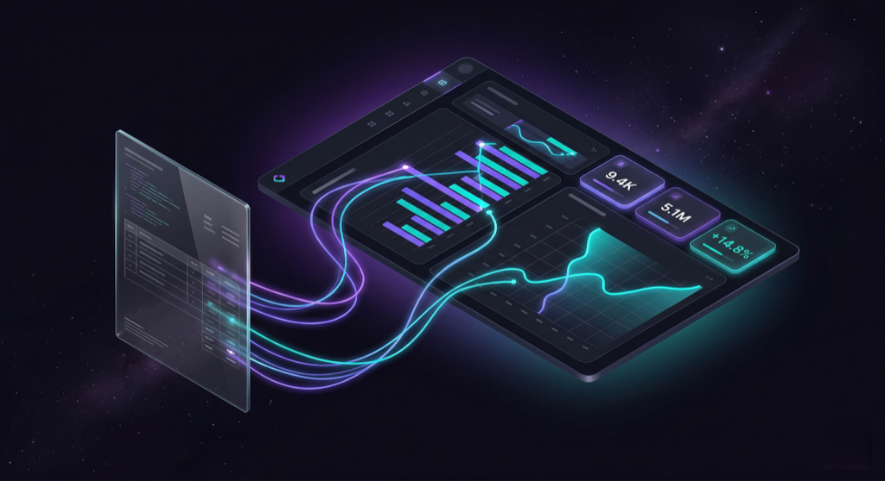

<p align="center">
  
</p>

<h1 align="center">celox ops</h1>

<p align="center">
  Business management for freelancers &amp; IT consultants — customers, orders, contracts,
  invoices with PDF, acquisition pipeline, AI usage tracking.<br>
  Gesch&auml;ftsverwaltung f&uuml;r Freelancer &amp; IT-Berater — Kunden, Auftr&auml;ge, Vertr&auml;ge,
  Rechnungen mit PDF, Akquise-Pipeline, KI-Nutzungstracking.
</p>

<p align="center">

<!-- badges:begin -->
[](#projektumfang)
[](#qualitätssicherung)
[](backend/tests)
[](frontend/src)
<!-- badges:end -->

</p>

<p align="center">

[](https://github.com/pepperonas/celox-ops/actions/workflows/ci.yml)
[](https://github.com/pepperonas/celox-ops/commits/main)
[](https://github.com/pepperonas/celox-ops/pulse)
[](https://github.com/pepperonas/celox-ops)
[](https://github.com/pepperonas/celox-ops)
[](https://docs.docker.com/compose/)
[](https://fastapi.tiangolo.com/)
[](https://www.python.org/)
[](https://react.dev/)
[](https://www.typescriptlang.org/)
[](https://vitejs.dev/)
[](https://www.postgresql.org/)
[](https://www.sqlalchemy.org/)
[](https://docs.pydantic.dev/)
[](https://tailwindcss.com/)
[](https://m3.material.io/)
[](https://weasyprint.org/)
[](https://www.chartjs.org/)
[](https://www.anthropic.com/)
[](https://zustand-demo.pmnd.rs/)
[](https://axios-http.com/)
[](https://nginx.org/)
[](https://docs.astral.sh/ruff/)
[](https://jwt.io/)
[](#sicherheit)
[](#mandantentrennung)
[](#frontend)
[](#rechnungen--geld)
[](https://www.linux.org/)
[](LICENSE)
[](https://celox.io)

</p>

<p align="center">
  <a href="README_DE.md"></a>
  &nbsp;&nbsp;
  <a href="README_EN.md"></a>
</p>

---

## Inhalt

- [Worum es geht](#worum-es-geht)
- [Projektumfang](#projektumfang)
- [Schnellstart](#schnellstart)
- [Architektur](#architektur)
- [Was drin ist](#was-drin-ist)
  - [Kunden, Aufträge, Verträge](#kunden-aufträge-verträge)
  - [Rechnungen & Geld](#rechnungen--geld)
  - [Rainmaker — Akquise](#rainmaker--akquise)
  - [KI-Funktionen](#ki-funktionen)
  - [Zeit, Ausgaben, EÜR](#zeit-ausgaben-eür)
  - [Dokumente & Compliance](#dokumente--compliance)
- [Frontend](#frontend)
- [Mandantentrennung](#mandantentrennung)
- [Sicherheit](#sicherheit)
- [Qualitätssicherung](#qualitätssicherung)
- [Entwicklung](#entwicklung)
- [Betrieb & Deployment](#betrieb--deployment)
- [Backup](#backup)
- [Zusammenspiel mit dem Token Tracker](#zusammenspiel-mit-dem-token-tracker)
- [Lizenz](#lizenz)

---

## Worum es geht

celox ops ist die Geschäftsverwaltung, mit der ich meine eigene Freelancer-Tätigkeit
betreibe: von der ersten Kaltakquise bis zur bezahlten Rechnung und zur EÜR am
Jahresende. Kein Baukasten für alle, sondern ein Werkzeug für einen konkreten
Arbeitsalltag — deutschsprachige Oberfläche, deutsches Rechnungs- und Steuerrecht,
Material Design 3 Expressive im dunklen Thema.

Der Unterschied zu einem Standardpaket liegt weniger im Funktionsumfang als in der
Härtung: gestellte Rechnungen sind unveränderlich, Löschungen sind widerrufbar,
KI-Vorschläge werden nie automatisch geschrieben, und jede Regel, auf die sich das
System verlässt, ist als Test festgenagelt — nicht als Kommentar.

---

## Projektumfang

<!-- loc-table:begin -->
| Bereich | Zeilen | Dateien |
|---|---:|---:|
| Backend (Python) | 25.157 | 139 |
| Frontend (TS/TSX) | 29.073 | 171 |
| Betrieb (Shell/SQL) | 483 | 21 |
| PDF-Vorlagen (Jinja) | 1.642 | 5 |
| **Anwendungscode** | **56.355** | |
| Tests (Backend) | 7.588 | 54 |
| Tests (Frontend) | 2.208 | 40 |
| **Testcode** | **9.796** | |
<!-- loc-table:end -->

Die Zahlen in dieser Tabelle und in den Badges oben sind **gemessen, nicht
geschätzt** — `scripts/update-badges.py` zählt sie und schreibt sie in dieses
README. Die Testzahl wird dabei nur übernommen, wenn beide Suiten wirklich grün
durchlaufen; der Badge behauptet „passing", also muss das auch stimmen.

```bash
python3 scripts/update-badges.py           # messen und Badges aktualisieren
python3 scripts/update-badges.py --check   # nur prüfen (Exit 1 bei Abweichung)
```

---

## Schnellstart

```bash
git clone https://github.com/pepperonas/celox-ops.git
cd celox-ops
cp .env.example .env      # Passwörter, JWT_SECRET, Geschäftsdaten eintragen
docker compose up -d --build
# → http://localhost:8090
```

Drei Werte in der `.env` sind Pflicht, sonst startet das Backend absichtlich nicht
bzw. blockiert alle Anfragen:

| Variable | Warum |
|---|---|
| `JWT_SECRET` | mind. 32 Zeichen, nicht der Vorgabewert — sonst verweigert der Start |
| `CORS_ORIGINS` | leer heißt: jede Cross-Origin-Anfrage wird blockiert |
| `ADMIN_PASSWORD_HASH` | bcrypt; in der `.env` muss `$` als `$$` geschrieben werden |

Der Anthropic-API-Key gehört **nicht** in die `.env`, sondern in die Einstellungen
der App (pro Arbeitsbereich, siehe [KI-Funktionen](#ki-funktionen)).

---

## Architektur

```
┌── nginx (Docker) ────────────────────────────────────────────┐
│   /            → Frontend (statisch, React-Build)            │
│   /api/        → Backend                                     │
│   /api/rainmaker/ → Backend, 300 s Timeout (KI-Läufe)        │
└──────────────────────────────────────────────────────────────┘
        │                                  │
   ┌────▼─────────────────┐        ┌───────▼──────────────┐
   │ FastAPI (Python 3.12)│        │ React 18 + Vite      │
   │ async SQLAlchemy 2.0 │        │ TypeScript, Tailwind │
   │ Pydantic v2          │        │ Zustand, Chart.js    │
   │ WeasyPrint (PDF)     │        │ PWA, Service Worker  │
   └────┬─────────────────┘        └──────────────────────┘
        │
   ┌────▼──────────┐   ┌──────────────────┐   ┌─────────────────┐
   │ PostgreSQL 16 │   │ Anthropic API    │   │ Token Tracker   │
   │ 30 Tabellen   │   │ (pro Workspace)  │   │ (optional)      │
   └───────────────┘   └──────────────────┘   └─────────────────┘
```

**Backend.** Ein Modul pro Fachbereich, jeweils Model → Schema → Router. Die
Geschäftslogik liegt in `services/` und ist so weit wie möglich **rein** gehalten:
Rechnungssummen, Rabatte, Adressumbruch, Dedup-Schlüssel, Website-Bewertung,
Zahlungszuordnung und die KI-Diffs sind Funktionen ohne DB und ohne Netz — deshalb
laufen über 600 Tests in wenigen Sekunden.

**Zwei Hintergrundaufgaben** laufen als asyncio-Tasks im FastAPI-Lifespan, nicht als
zweite Infrastruktur: der stündliche Cron (überfällige Rechnungen, Vertragsrechnungen,
Erinnerungsmail) und der Website-Analyse-Worker (begrenzte Parallelität, arbeitet die
Analyse-Queue ab).

**Zeitzone.** Alle Datumsentscheidungen laufen über `services/business_time.py`
(`Europe/Berlin`) und sind damit unabhängig von der Container-Konfiguration korrekt.
Ein Test verbietet nackte `date.today()`/`datetime.now()` im Anwendungscode — der
UTC-Versatz hatte zuvor Erinnerungsmails um zwei Stunden verschoben und Tagesgrenzen
falsch gesetzt.

---

## Was drin ist

### Kunden, Aufträge, Verträge

Vollständiges CRUD mit Statusverläufen, Kanban-Board für Aufträge (mit Undo beim
Ziehen), wiederkehrende Verträge mit automatischer Rechnungsstellung, Kontakthistorie,
Dateianhänge mit Beschreibung und MIME-Whitelist, PageSpeed-Prüfung je Kundenwebsite,
DSGVO-Export je Kunde, sowie ein Kunden-Handoff an das celox Portal und die
Datenschutz-Plattform (Feld-Whitelist, Vorschau vor dem Senden).

### Rechnungen & Geld

- **PDF-Rechnungen** mit WeasyPrint + Jinja2, DIN-5008-Anschriftenblock, Rabatten
  (prozentual oder fest), Kleinunternehmerregelung, Sondervereinbarungen, optionalem
  KI-Nutzungsbericht und Commit-Nachweis als Anlage.
- **Nummernkreis pro Arbeitsbereich** (`CO-2026-0001`), serialisiert über ein
  Advisory Lock — parallele Anlagen kollidieren nicht.
- **Gestellte Rechnungen sind unveränderlich (GoBD).** Ein `PUT` auf eine gestellte
  Rechnung wird mit 409 abgelehnt und nennt den korrekten Weg: **Stornieren
  (Gutschrift) + Duplizieren**. Verglichen werden Werte, nicht Anwesenheit — ein
  unveränderter Formular-Submit läuft also durch.
- **Gutschriften** mit eigenem Nummernkreis (`GS-2026-0001`), gespiegelten Beträgen
  und Pflichtzeile nach § 14 Abs. 4 UStG; die Statusmatrix unterscheidet Netting
  (bezahlt) von Neutralisierung (offen).
- **Mahnwesen** in drei Stufen mit eigenem PDF und Mailversand.
- **Zahlungsabgleich per Kontoauszug**: camt.052/053/054 oder CSV einlesen (Spalten
  über Aliase erkannt, Soll/Haben-Kennzeichen berücksichtigt), Zuordnung dreistufig
  (Rechnungsnummer + Betrag / Nummer allein / eindeutiger Betrag). Mehrdeutiges wird
  **nicht geraten**, sondern mit Begründung ausgewiesen; gebucht wird nur, was
  bestätigt ist, und das ist widerrufbar.

### Rainmaker — Akquise

Kein Adressbuch, sondern eine Aktivierungsschicht: die **Heute-Queue** zeigt, was
heute zu tun ist, ein offener Lead ohne nächsten Schritt gilt als „verrottend" und
wird rot markiert. Der **Next-Action-Zwang** verlangt beim Abschließen einer Aktion
atomar die nächste. Dazu Punkte, eine Werktags-Streak mit Einfrier-Budget, ein
Traumziel als Erwartungswert-Motor („ein Nein am Telefon ist trotzdem 225 € Richtung
Porsche") und eine tägliche Erinnerungsmail.

Die **Pipeline** ist ein Kanban-Board über acht Phasen mit eigenem Scroll-Container
je Spalte (damit eine 351er-Spalte nicht die anderen Phasen wegschiebt),
Infinite-Scroll, Filtern nach Quelle, E-Mail-Qualität, Target, Favoriten und
Zeitraum — alle persistiert.

**Leads finden** über OpenStreetMap/Overpass (kostenlos) oder Google Places, mit
Live-Erreichbarkeitsprüfung der Website („keine Karteileichen"), leichter Anreicherung
(Kurzbeschreibung, Social-Profile, Tech-Stack, Datenschutz-Ampel) und zentraler
Duplikaterkennung über E-Mail, Website und Name — abgesichert durch partielle
Unique-Indizes in der Datenbank.

### KI-Funktionen

Alle KI-Funktionen laufen über **Claude** und teilen einen Stack: erzwungenes
Tool-Use für strukturierte Ausgaben, gecachte System-Prompts, exakte Kostenrechnung
aus der API-Nutzung, hartes Monatsbudget und Protokollierung jedes Laufs.

| Funktion | Was sie tut |
|---|---|
| **Lead-Suche** | Freitext-Brief → Suchparameter → OSM/Web → verifizierte, nach Fit gerankte Leads |
| **Lead-Erfassung** | Chatverlauf, E-Mail oder bis zu 6 Screenshots → neue Lead-Entwürfe mit Notizen und geplanten Aktionen |
| **Lead aus Chat aktualisieren** | Material zu einem bestehenden Lead → Notizen, Aktivitäten, Stammdaten |
| **Akquise-Mail** | Entwurf passend zum Target, fünf Themen-Playbooks, Entwurf-Cache spart Tokens |
| **Website-Analyse** | Datenschutz, SEO, Technik, Performance, UX — optional mit KI-Qualitätsurteil und PageSpeed |

Drei Prinzipien gelten überall:

1. **Nichts wird automatisch geschrieben.** Die KI schlägt vor, der Mensch hakt einzeln
   ab, danach gibt es einen Undo-Toast.
2. **Nichts wird erfunden.** Stammdatenvorschläge brauchen ein wörtliches Belegzitat,
   sonst werden sie verworfen und mit Begründung als „nicht belegt" ausgewiesen. Das
   ist im Code durchgesetzt, nicht nur im Prompt gebeten.
3. **Eigener Schlüssel pro Arbeitsbereich.** Jeder Bereichs-Inhaber hinterlegt seinen
   Anthropic-Key in den Einstellungen und rechnet darüber ab. Es gibt bewusst **keinen**
   Rückfall auf eine globale `.env` — sonst würde ein neuer Nutzer auf Kosten eines
   anderen abfragen. Mitarbeitende nutzen den Schlüssel ihres Bereichs, dürfen ihn aber
   nicht ändern.

### Zeit, Ausgaben, EÜR

Zeiterfassung mit Autocomplete-Taxonomie und Stundennachweis-PDF, Ausgabenverwaltung,
Einnahmen-Überschuss-Rechnung mit CSV-Export und Monatsbericht-PDF, Live-Wechselkurs
(EZB-Referenzkurs über die Frankfurter-API, mit Cache und Plausibilitätsgrenzen), sowie
ein iCal-Feed für Fristen und Termine.

- **Hostinger-Kostenimport**: laufende Kosten für VPS und Domains per API-Key
  übernehmen — Vorschau, Auswahl, dann schreiben. Die API liefert Verträge, keine
  Belege, also wird der Ist-Stand je aktivem Abo übernommen und auf die letzte
  Abrechnung datiert; vergangene Perioden werden nicht hochgerechnet. Ein Zeitraum kann
  durch eine Referenz je Abo und Datum nicht zweimal gebucht werden, und was
  übersprungen wurde, steht mit Grund im Dialog.
- **Welche Domain zu welchem Abo gehört**, sagt die API nicht — ein Abo heißt nur
  „.DE Domain". Der Verbund ist aber messbar: je TLD stimmt die Anzahl exakt, und die
  Domain wird unmittelbar nach dem Abo registriert (meist innerhalb von Sekunden).
  Die Zuordnung läuft deshalb **innerhalb einer TLD über die Reihenfolge der
  Anlagezeit** — bei gleicher Anzahl die einzige reihenfolgetreue Möglichkeit, und
  deckungsgleich mit der kostenminimalen Zuordnung. Weil es eine **Ableitung** bleibt,
  nennt jede Buchung ihre Herkunft („1 s nach dem Abo registriert, also dieselbe
  Bestellung" bzw. „aus der Reihenfolge, Abstand 5 Tage, bitte prüfen"), ohne
  Zeitstempel auf beiden Seiten wird gar keine Domain behauptet, und eine Korrektur im
  Dialog wird gespeichert und schlägt künftig die Ableitung.

### Dokumente & Compliance

Zehn Rechtsdokument-Vorlagen mit Kundenplatzhaltern und digitaler Signatur, ZIP-Download
aller Dokumente je Kunde, und ein Compliance-Tracking, das prüft, ob von jedem Kunden
die Pflichtdokumente (Standard: AGB + AVV) unterschrieben vorliegen — inklusive Upload
des unterschriebenen PDFs.

---

## Frontend

React 18 mit TypeScript, Vite und TailwindCSS im **Material Design 3 Expressive**
Dark-Theme. Die Design-Token in `index.css` sind die einzige Quelle für Farbe, Radius,
Motion und Elevation — der verbindliche Kanon steht in
[`.claude/rules/frontend-m3e.md`](.claude/rules/frontend-m3e.md).

Bemerkenswert:

- **Kein View-Transitions-API.** Bewusst: VT snapshottet die async ladenden
  Chart.js-Ansichten und flackert. Stattdessen ein GPU-only Page-Reveal mit
  Richtungserkennung.
- **Dropdowns nie nativ.** `components/Select.tsx` portalt die Liste an
  `document.body`, damit sie in Modals und Sticky-Leisten nicht abgeschnitten wird —
  Stand: 0 native `<select>` im Quelltext.
- **Modals portalen immer.** Ein `position: fixed`-Element in einem transformierten
  Vorfahren bekommt einen neuen Containing-Block und sitzt falsch.
- **PWA** mit versioniertem Service-Worker-Cache, network-first für Navigationen und
  drei Schichten gegen veraltete Chunks nach einem Deploy.
- **Globales Undo** für Statuswechsel, Kanban-Züge, Löschungen und KI-Übernahmen.
- Responsive bis 390 px verifiziert (kein horizontaler Überlauf), Touch-Ziele ≥ 44 px, `prefers-reduced-motion` schaltet alle
  Animationen global ab.

---

## Mandantentrennung

Jeder Datensatz gehört einem Arbeitsbereich (`owner_id`). Die Isolation hängt nicht an
Filtern in einzelnen Routern, sondern an zwei SQLAlchemy-Session-Events: ein
`do_orm_execute`-Hook filtert **jedes** ORM-SELECT auf den aktuellen Bereich, ein
`before_flush`-Hook stempelt neue Objekte. Router brauchen deshalb in der Regel keine
manuelle Filterung.

Drei Grenzen dieses Mechanismus sind als Integrationstests gegen eine echte Postgres
festgehalten, weil Router-Code sich darauf verlässt:

| Grenze | Konsequenz im Code |
|---|---|
| Nicht gesetzter Kontext = global | Cron und Worker setzen den Bereich **pro Vorgang** selbst |
| Bulk-`UPDATE` läuft nicht durch die Events | betroffene Services filtern `owner_id` explizit |
| `with_loader_criteria` validiert keine INSERTs | Router prüfen jede Fremdschlüssel-ID mit einem gescopten Select |

**Drei Rollen:** `admin` (alles inkl. Benutzerverwaltung), `user` (eigener, isolierter
Bereich), `mitarbeiter` (arbeitet im Bereich eines anderen, **ohne** destruktive Rechte).
Die Löschsperre sitzt in einer Middleware statt in jeder Route — so kann keine vergessen
werden — und prüft die Rolle gegen die Datenbank, nicht gegen einen JWT-Claim.

---

## Sicherheit

- **JWT** mit bcrypt-Hashes, optionaler TOTP-2FA pro Nutzer, optionalem
  „Sign in with Google" (ID-Token serverseitig verifiziert, kein Auto-Signup),
  Rate-Limit auf dem Login.
- **API-Schlüssel verlassen den Server nie.** Antworten tragen nur „konfiguriert ja/nein"
  und eine Maske (`••••Ab12`); ein Test verbietet ein Klartextfeld im Response-Schema.
- **SSRF-Schutz** bei jedem Abruf fremder Websites: Schema-Zwang, userinfo entfernt,
  Redirects nicht automatisch gefolgt, **jeder** Hop per DNS aufgelöst und gegen private,
  Loopback-, Link-local- und Metadaten-Adressen geprüft. TLS wird strikt verifiziert —
  ein ungültiges Zertifikat ergibt einen kritischen Befund, ohne den Inhalt zu laden.
- **XML-Uploads** (Kontoauszüge): `DOCTYPE`/`ENTITY` werden vor dem Parsen abgewiesen,
  was Entity-Expansion („billion laughs") ohne zusätzliche Abhängigkeit ausschließt.
- **Mailversand nur nach zweistufiger Bestätigung** — kein Kunden- oder Interessenten-Mail
  geht mit einem einzelnen Klick raus.
- **Audit-Log** über jede mutierende Anfrage, best-effort und nie blockierend.
- Secrets liegen ausschließlich in der `.env` auf dem Server und werden nie committet;
  ein Pre-Commit-Check sucht nach versehentlich eingecheckten Geheimnissen.

---

## Qualitätssicherung

<!-- badges:begin -->
[](#projektumfang)
[](#qualitätssicherung)
[](backend/tests)
[](frontend/src)
<!-- badges:end -->

```bash
# Backend (im Container, keine lokale Python-Umgebung nötig)
docker compose -f docker-compose.dev.yml run --rm --no-deps \
  -v "$PWD/backend/tests:/app/tests" backend python -m pytest -q

# Frontend
cd frontend && npm test && npx tsc --noEmit

# Lint über den ganzen Backend-Baum (der Pre-Commit-Hook prüft nur Staged Files)
ruff check backend/
```

**Fast alle Tests laufen ohne Datenbank.** Das ist kein Zufall, sondern das Ergebnis
davon, dass die Fachlogik in reine Funktionen gezogen wurde: Rechnungssummen und
Rabatte, Storno-Statusmatrix, Gutschrift-Nummernkreis, DIN-5008-Adressumbruch,
Dedup-Schlüssel, Trigramm-Duplikatsuche, E-Mail-Qualitätsurteil, Website-Signale und
-Scoring, Kontoauszug-Parser und -Zuordnung, KI-Diffs und Fingerprints, Streak- und
Punktelogik, Zeitzonen-Grenzen.

**Integrationstests** (12) laufen gegen eine echte Postgres und decken genau das ab,
was DB-frei nicht ehrlich prüfbar ist: die Mandantentrennung. Sie überspringen sich
ohne `TEST_DATABASE_URL` und haben einen Sicherheitsstopp, falls der Datenbankname
kein „test" enthält — sie legen alle Tabellen neu an.

**KI-Tests** laufen mit gefaketem Anthropic-Client. Geprüft wird, was das Projekt
kontrolliert: Prompt-Aufbau, die Trennung von Daten und Anweisungen, Belegzwang,
Idempotenz, Kostenrechnung — nicht das Modellverhalten.

Ein Teil der Tests sind bewusst **Regressionsguards** für Regeln, die man leicht
versehentlich aufweicht:

- importierte Historie darf keine Punkte oder Streak vergeben
- der Auto-Analyse-Worker darf nie Kosten verursachen
- keine nackten `date.today()`/`datetime.now()` im Anwendungscode
- kein globaler Zugriff auf den `.env`-KI-Schlüssel zur Laufzeit
- kein Klartext-Schlüssel in einem Response-Schema
- keine Union-Typen in Tool-Schemas (ein Modell wich daran in einen JSON-String aus)
- die Feldliste, die den Rechnungs-Riegel treibt, muss zum Schema passen

**CI** (GitHub Actions) läuft bei jedem Push in drei Jobs: `backend` (ruff +
Router-Import-Smoke + pytest), `tenancy` (Integrationstests mit Postgres-Service) und
`frontend` (tsc + vitest + Build).

---

## Entwicklung

```bash
docker compose -f docker-compose.dev.yml up -d --build
# Backend  http://localhost:8000   (Auto-Reload)
# Frontend http://localhost:5173   (Vite HMR)
# API-Doku http://localhost:8000/docs
# Datenbank localhost:5433
```

**Schema-Änderungen.** Tabellen entstehen beim Start über `Base.metadata.create_all` —
eine neue Tabelle braucht also keine Migration. **Neue Spalten auf bestehenden Tabellen
brauchen ein manuelles `ALTER`**, und das muss **vor** dem Deploy laufen: eine
Modellspalte ohne Datenbankspalte bricht jedes SELECT auf dieser Tabelle. Die passenden
Skripte liegen in `backend/scripts/*.sql`. Alembic ist vorhanden, wird aber nicht für
Auto-Migrationen benutzt.

Die ausführliche Entwickler-Referenz — Konventionen, Fallstricke, Architekturentscheidungen
mit Begründung — steht in [`CLAUDE.md`](CLAUDE.md). Sie ist die Datei, die man vor der
ersten Änderung liest.

---

## Betrieb & Deployment

```bash
tar czf /tmp/celox-ops.tar.gz --exclude='.git' --exclude='node_modules' \
    --exclude='.env' --exclude='.claude' .
scp /tmp/celox-ops.tar.gz root@VPS:/tmp/
ssh root@VPS 'cd /opt/celox-ops && tar xzf /tmp/celox-ops.tar.gz && \
  docker compose up -d --build backend frontend'
```

Auf dem Zielserver zieht ein Cron alle fünf Minuten `origin/main` und baut nur, was
sich geändert hat. Zwei Betriebsdetails, die Zeit gekostet haben und deshalb hier stehen:

- Der Docker-nginx hat einen `resolver` und löst Upstreams **pro Request** auf — nach
  einem Rebuild gibt es damit kein 502-Fenster mehr.
- `nginx/default.conf` ist als **einzelne Datei** gemountet. Ein `git pull` schreibt
  einen neuen Inode, `docker compose restart nginx` mountet aber weiter den alten.
  Nach Änderungen an dieser Datei ist `docker compose up -d --force-recreate nginx`
  nötig.

---

## Backup

Nächtlich um 03:00: PostgreSQL-Dump plus das Datei-Volume (PDFs, Anhänge,
PageSpeed-Berichte), 30 Tage Aufbewahrung.

Dazu zwei Dinge, die ein Backup erst zu einem Backup machen:

- **Wöchentliche Restore-Probe** (`scripts/restore-test.sh`): spielt das neueste Backup
  in einer Wegwerf-Datenbank zurück, prüft Alter, Kerntabellen, rechenbare
  Rechnungssummen und die Lesbarkeit des Datei-Archivs, und meldet das Ergebnis
  einzeilig plus Mail bei Fehlschlag. Ein Backup, das nie zurückgespielt wurde, ist
  eine Vermutung.
- **Kopie außer Haus**: ein zweiter Rechner **zieht** die Backups täglich über einen
  per `rrsync -ro` auf das Backup-Verzeichnis beschränkten Schlüssel. Ziehend statt
  schiebend, damit ein kompromittierter Server die Zweitkopie nicht verändern kann.

---

## Zusammenspiel mit dem Token Tracker

Mit [Claude Token Tracker](https://github.com/pepperonas/claude-token-tracker) wird die
KI-Nutzung je Kunde und Projekt transparent: Arbeitszeit, Codezeilen, Kosten pro Projekt,
Diagramme im Kundendetail und ein Nutzungsbericht als Anlage zur Rechnung. Optional —
ohne Tracker funktioniert alles andere unverändert.

---

## Links

- **GitHub** — [github.com/pepperonas/celox-ops](https://github.com/pepperonas/celox-ops)
- **Token Tracker** — [github.com/pepperonas/claude-token-tracker](https://github.com/pepperonas/claude-token-tracker)
- **Feature-Referenz** — [Deutsch](README_DE.md) · [English](README_EN.md)
- **Entwickler-Referenz** — [CLAUDE.md](CLAUDE.md)
- **Autor** — [Martin Pfeffer](https://celox.io)

## Lizenz

[MIT](LICENSE)

---

*Built by [Martin Pfeffer](https://celox.io)*
